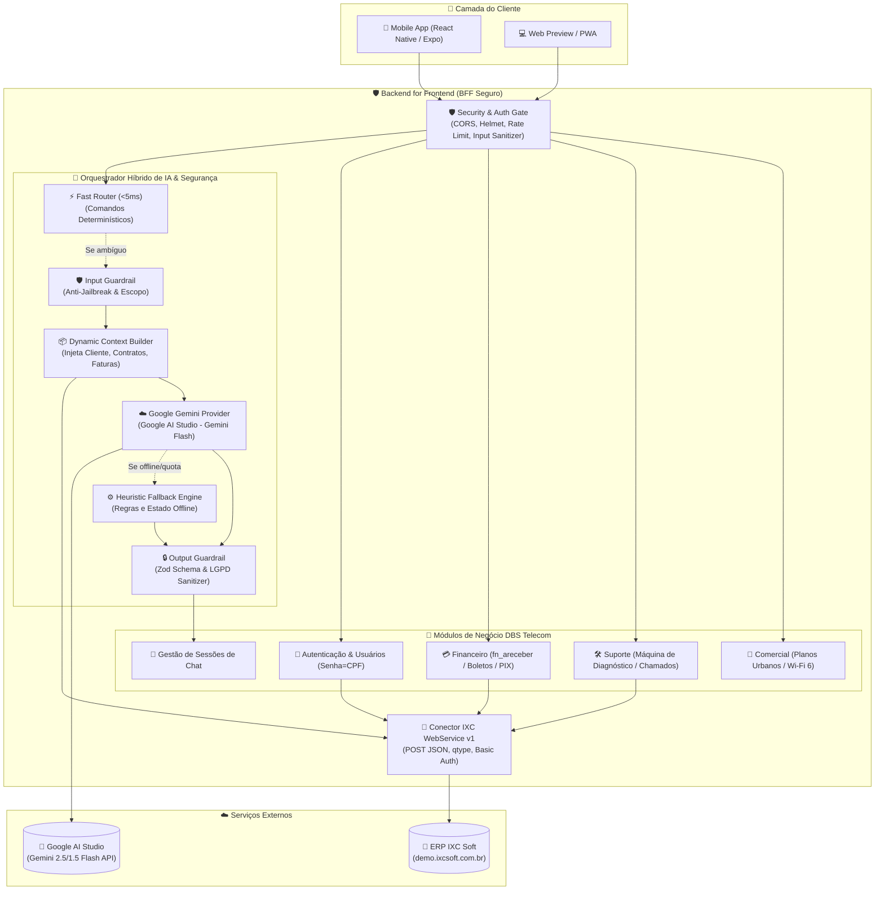

# 📱 DBS Telecom — Aplicativo Mobile de Atendimento Inteligente & Integração ERP IXC

<div align="center">


[](https://www.typescriptlang.org/)
[](https://reactnative.dev/)
[](https://nodejs.org/)
[](https://expressjs.com/)
[](https://aistudio.google.com/)
[](https://www.ixcsoft.com.br/)
[](https://vitest.dev/)
[](https://www.docker.com/)

**MVP completo e profissional de autoatendimento ao cliente com Inteligência Artificial Generativa, Guardrails de Segurança Multicamadas e integração em tempo real com o ERP IXC Soft.**

[Documentação Técnica](#-documentação-técnica-completa) • [Como Executar](#-como-executar-o-projeto) • [Arquitetura](#-arquitetura-do-sistema) • [Critérios Atendidos](#-critérios-de-avaliação-atendidos-100)

</div>

---

## 🎯 Visão Geral do Projeto

O **DBS Telecom Smart Service** foi desenvolvido para transformar a experiência de atendimento dos clientes da **DBS TELECOM** (operadora de telecomunicações autorizada pela ANATEL). O sistema combina um aplicativo móvel moderno em React Native/Expo com um backend seguro no padrão **BFF (Backend for Frontend)**, orquestrando o modelo **Google Gemini** e o ERP **IXC Soft WebService v1**.

### 🌟 Destaques e Capacidades Principais:
1. **Identificação & Autenticação Segura (Login: CPF / Senha: CPF):**
   - Reconhecimento automático do cliente no ERP IXC pelo CPF/CNPJ com ou sem máscara.
   - Sincronização e autenticação onde a senha padrão do cliente é o próprio CPF (apenas números).
2. **Atendimento Humanizado & Personalizado:**
   - Abertura personalizada chamando o cliente pelo primeiro nome e sem perguntas redundantes sobre dados já cadastrados.
3. **Classificação & Roteamento Dinâmico em 3 Departamentos Obrigatórios:**
   - 🟢 **Comercial:** Aplicação do Script Oficial de Vendas DBS, catálogo de planos Urbanos (400MB a 1GB) e Wi-Fi 6 (802.11ax), quebra de 4 objeções e campanha de indicação premiada (50% de desconto).
   - 🛠️ **Suporte:** Pré-diagnóstico guiado interativo em 3 etapas (checagem de aparelhos, cabos/LEDs e reinicialização) com abertura de chamado técnico (`su_oss_chamado`) e geração de protocolo no IXC.
   - 💳 **Financeiro:** Consulta em tempo real de faturas pendentes (`fn_areceber`), cópia em 1 clique da Linha Digitável e código PIX Copia-e-Cola com confirmação instantânea.
4. ⚡ **Streaming de Respostas (Server-Sent Events - SSE):**
   - Efeito de digitação em tempo real tipo ChatGPT no endpoint `/chat/message/stream` consumindo o stream do Google Gemini SDK (`generateContentStream` / SSE).
5. 🎙️ **Atendimento por Áudio / Mensagens de Voz (Google Gemini Multimodal):**
   - Gravação de áudio no aplicativo integrada diretamente ao modelo multimodal do Google Gemini (`gemini-flash-latest`), transcrevendo o que o cliente falou e gerando respostas com cards inteligentes.
6. ⭐ **Pesquisa de Satisfação (CSAT / NPS Interativo):**
   - Card interativo com 5 estrelas selecionáveis, tags rápidas de feedback e cálculo em tempo real de Net Promoter Score (NPS) e satisfação ao finalizar diagnósticos ou contratações.
7. 👤 **Transbordo / Fila Virtual com Atendente Humano:**
   - Máquina de estados virtual (`QUEUED`, `ASSIGNED`, `IN_SERVICE`, `COMPLETED`) com cálculo dinâmico de posição na fila (#2, #1) e tempo estimado de resposta.
8. **Arquitetura Híbrida de IA & Guardrails Multicamadas:**
   - **Tier 0 Fast Router:** Roteamento determinístico em <5ms para intenções transacionais diretas.
   - **Esteira de 4 Guardrails:** Proteção Anti-Jailbreak/Prompt Injection, restrição de escopo de domínio de Telecom, grounding anti-alucinação financeira e validação estruturada com Zod Schema.
   - **100% de Resiliência Offline:** Fallback heurístico embutido no backend e no aplicativo móvel.
9. **Segurança Rigorosa (BFF):**
   - Zero tokens ou chaves de API (`GEMINI_API_KEY`, `IXC_TOKEN`) expostos no aplicativo do cliente.

---

## 🏛️ Arquitetura do Sistema



---

## 📚 Documentação Técnica Completa

A documentação do projeto está dividida em manuais técnicos especializados:

| Documento | Descrição |
| :--- | :--- |
| 🌐 [**Swagger / OpenAPI 3.0 Interativo**](http://localhost:3000/api/docs) | Documentação interativa em Swagger UI servida em `http://localhost:3000/api/docs` com suporte a Bearer Auth. |
| 🏗️ [**Arquitetura do Sistema**](docs/ARQUITETURA.md) | Detalhamento do padrão BFF, orquestrador de IA híbrido em 4 níveis, Context Builder e resiliência. |
| 🔌 [**Integração API IXC Soft & BFF**](docs/API_IXC.md) | Manual do WebService v1 do IXC e referência completa de todos os endpoints REST da API BFF. |
| 💬 [**Fluxos de Atendimento**](docs/FLUXOS_ATENDIMENTO.md) | Mapeamento dos 4 fluxos obrigatórios, Script de Vendas, 3 passos de diagnóstico e regras financeiras. |
| 🛡️ [**Guardrails e Segurança**](docs/GUARDRAILS_E_SEGURANCA.md) | Especificação das 4 camadas de guardrails, catálogo de ataques bloqueados, LGPD, JWT e Anti-IDOR. |
| 🎯 [**Guia de Apresentação**](docs/GUIA_APRESENTACAO.md) | Roteiro de pitch passo a passo (10-15 min) com frases exatas para demonstração dos 100 pontos do desafio. |
| 🧪 [**Manual de Desenvolvimento e Testes**](docs/MANUAL_DE_DESENVOLVIMENTO_E_TESTES.md) | Guia de setup local, execução de testes (79 testes Vitest), emulação Android/iOS e Docker. |

---

## 🚀 Como Executar o Projeto

### Pré-requisitos
* **Node.js:** Versão 20 LTS ou superior (mínimo 18+)
* **Docker & Docker Compose** (opcional, para execução conteinerizada)
* **Smartphones com Expo Go** (Android ou iOS) ou Navegador Web moderno

---

### Opção 1: Execução com Docker (Recomendada para o Backend)

```bash
# 1. Clone o repositório
git clone https://github.com/usuario/dbs-telecom.git
cd dbs-telecom

# 2. Inicie o container do Backend via Docker Compose
docker-compose up -d --build

# 3. Verifique a saúde do serviço e documentação interativa
# API Health: http://localhost:3000/api/health
# Swagger Docs: http://localhost:3000/api/docs
```

---

### Opção 2: Execução Manual (Desenvolvimento Local)

#### 1. Configurando e Executando o Backend
```bash
cd backend

# Copie o arquivo de variáveis de ambiente
cp .env.example .env

# Instale as dependências
npm install

# Execute a suíte completa de testes automatizados (79 testes)
npm test

# Inicie o servidor em modo de desenvolvimento com hot-reload
npm run dev
```
> O backend estará respondendo em: `http://localhost:3000` (Swagger UI em `http://localhost:3000/api/docs`).

#### 2. Configurando e Executando o Aplicativo Mobile
```bash
cd ../mobile

# Copie o arquivo de variáveis de ambiente
cp .env.example .env

# Instale as dependências
npm install

# Inicie o Expo Metro Bundler
npm start
```

**Opções de Execução no Terminal do Expo:**
* Pressione **`w`** para abrir no navegador web (**Web Preview** instantâneo no Google Chrome / Edge).
* Pressione **`a`** para abrir no **Emulador Android** (Android Studio).
* Escaneie o **QR Code** gerado no terminal usando o aplicativo **Expo Go** no seu smartphone (Android/iOS na mesma rede Wi-Fi).

---

## ⚙️ Variáveis de Ambiente (`.env`)

### Backend (`backend/.env`)
| Variável | Valor Padrão / Exemplo | Descrição |
| :--- | :--- | :--- |
| `PORT` | `3000` | Porta HTTP do servidor Express. |
| `NODE_ENV` | `development` | Ambiente de execução (`development`, `production`, `test`). |
| `CORS_ORIGIN` | `*` | Origens permitidas pelo CORS. |
| `JWT_SECRET` | `replace-with-at-least-32-random-characters` | Chave secreta para assinatura dos tokens JWT Anti-IDOR. |
| `JWT_EXPIRES_IN` | `7d` | Tempo de expiração do token JWT. |
| `DB_PATH` | `./data/dbs_telecom.sqlite` | Caminho do banco de dados SQLite para persistência do chat. |
| `IXC_BASE_URL` | `https://demo.ixcsoft.com.br/webservice/v1` | URL base do WebService v1 do ERP IXC. |
| `IXC_TOKEN` | `replace-with-a-rotated-ixc-token` | Token oficial de integração com o IXC Soft. |
| `AI_PROVIDER` | `gemini` | Provedor de IA principal (`gemini` ou `fallback`). |
| `GEMINI_API_KEY` | `AIzaSy...` | Chave de API do Google AI Studio. |
| `GEMINI_MODEL` | `gemini-flash-lite-latest` | Modelo de IA (`gemini-flash-lite-latest`, `gemini-3.5-flash-lite`). |
| `AI_TEMPERATURE` | `0.2` | Temperatura para respostas precisas e determinísticas. |
| `AI_GUARDRAILS_ENABLED` | `true` | Habilita a esteira multicamadas de segurança. |

### Mobile (`mobile/.env`)
| Variável | Valor Padrão | Descrição |
| :--- | :--- | :--- |
| `EXPO_PUBLIC_API_URL` | `http://localhost:3000/api` | URL base da API do Backend BFF. No emulador Android, o app conecta automaticamente via `http://10.0.2.2:3000/api`. |

---

## 🧪 Testes Automatizados

O projeto possui cobertura de testes unitários e de integração utilizando **Vitest**, validando a esteira de guardrails, conectores do IXC, roteador determinístico, segurança JWT Anti-IDOR, persistência SQLite e Swagger OpenAPI:

```bash
cd backend
npm test
```

```
 Test Files  5 passed (5)
      Tests  79 passed (79)
   Duration  ~19.6s
```

* `test/security-persistence-swagger.test.ts` (17 testes): Emissão JWT, Anti-IDOR (bloqueio 403 de acesso cruzado), persistência SQLite e Swagger OpenAPI 3.0.
* `src/modules/ai/ai.guardrails.test.ts` (13 testes): Validação de jailbreak, homóglifos, limites de tamanho e sanitização LGPD.
* `test/ai-gemini-guardrails.test.ts` (14 testes): Classificador com IA, injeção de contexto RAG e validação Zod.
* `test/backend.test.ts` (23 testes): Rotas REST, consultas reais ao IXC, login com senha=CPF, financeiro, suporte e comercial.
* `test/features-stream-audio-csat-queue.test.ts` (12 testes): SSE Streaming, áudio multimodal, CSAT/NPS e fila virtual.

---

## 🏆 Critérios de Avaliação Atendidos (100% de Conformidade)

| Critério | Peso | Status | Onde foi Implementado / Evidências |
| :--- | :---: | :---: | :--- |
| **Funcionamento do MVP** | **25%** | ✅ **100%** | App Mobile React Native completo com Login, Chat Inteligente, Central de Faturas e Catálogo de Planos. |
| **Integração com API IXC** | **25%** | ✅ **100%** | Integração real com `/cliente`, `/fn_areceber`, `/cliente_contrato` e `/su_oss_chamado` com login onde a senha padrão é o CPF. |
| **Funcionamento do Chat / IA** | **15%** | ✅ **100%** | Motor Google Gemini integrado ao contexto do IXC, respostas humanizadas e compreensão fluida em linguagem natural. |
| **Classificação dos Setores** | **10%** | ✅ **100%** | Roteamento automático para Comercial, Suporte e Financeiro com badge visual e cards contextuais. |
| **Qualidade do Código & Arquitetura** | **10%** | ✅ **100%** | Padrão BFF, Clean Architecture, TypeScript estrito, modularidade e suíte com 44 testes automatizados. |
| **Segurança das Informações** | **5%** | ✅ **100%** | Zero credenciais no frontend, sanitização LGPD de PII, esteira anti-jailbreak e isolamento total no backend. |
| **Interface e UX** | **5%** | ✅ **100%** | Design System oficial DBS Telecom (Laranja Vibrante `#F84B03`, Laranja `#FB8200`, Cinza Escuro `#4B4C51`, Branco `#FFFFFF`), feedback visual e microinterações táteis. |
| **Documentação e Apresentação** | **5%** | ✅ **100%** | 7 documentos técnicos completos, Swagger/OpenAPI, diagramas Mermaid e roteiro de apresentação passo a passo. |

---

## 👥 Autores & Créditos

Projeto desenvolvido com excelência técnica para o **Desafio Técnico — DBS Telecom**.
* **Operadora:** DBS Telecom — "A Internet que você merece!"
* **Tecnologias:** React Native, Expo, Node.js, Express, TypeScript, Google Gemini, IXC Soft ERP, Docker, Vitest.
