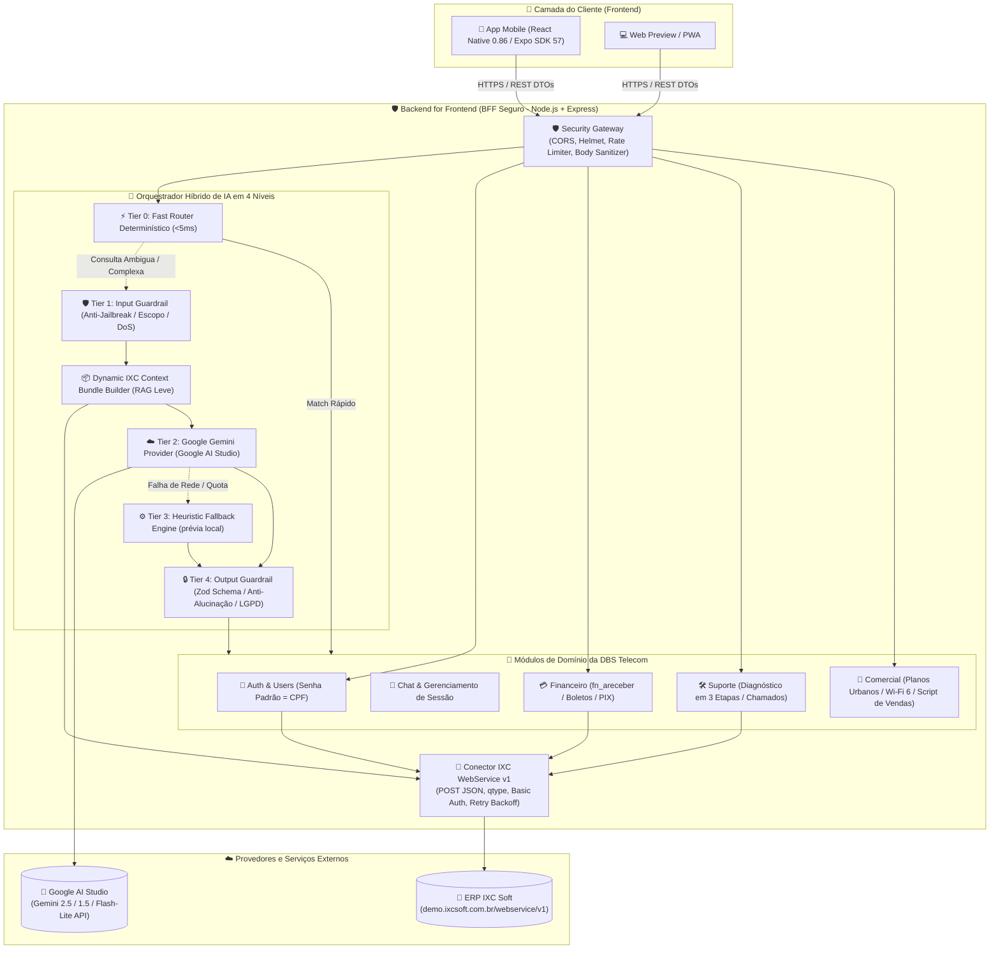
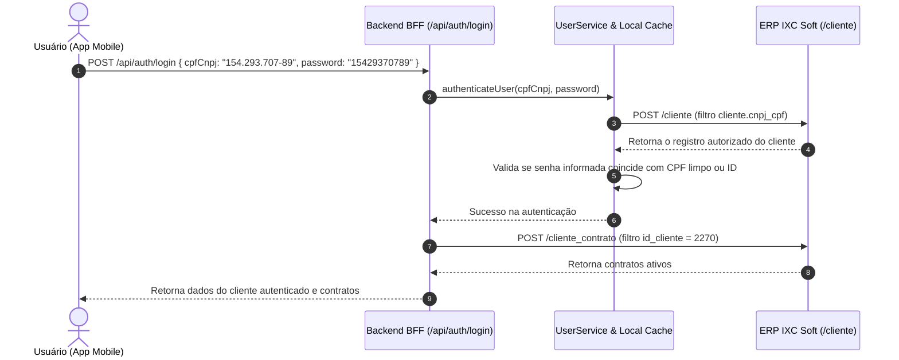
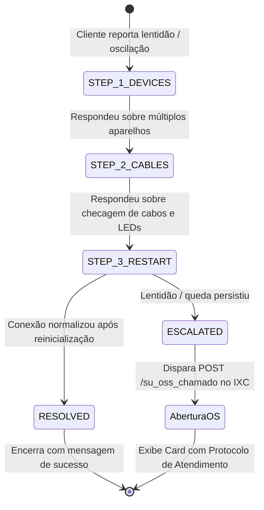
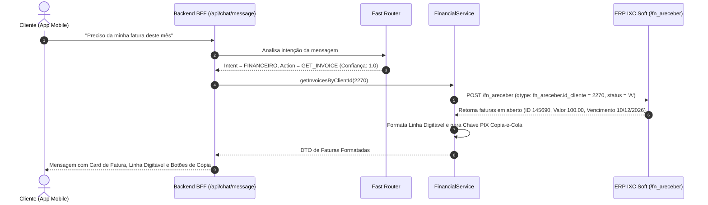

# 🏗️ Arquitetura do Sistema — DBS Telecom Mobile & Backend BFF

Este documento detalha a arquitetura técnica, os padrões de projeto, as decisões estruturais, o fluxo de dados e os princípios de segurança adotados no ecossistema do **Aplicativo Mobile e Backend de Atendimento Inteligente da DBS Telecom** integrado ao ERP **IXC Soft**.

---

## 1. Visão Geral da Arquitetura

O sistema adota o padrão **BFF (Backend for Frontend)** combinado com uma arquitetura modular em camadas orientada a domínio (Domain-Driven Modules). O aplicativo móvel atua exclusivamente como cliente de apresentação e interação do usuário, enquanto o Backend centraliza a segurança, a orquestração do motor de Inteligência Artificial, as regras de negócio de telecomunicações e a comunicação segura com o ERP IXC Soft.



---

## 2. Princípios e Decisões de Arquitetura

### 2.1 Padrão Backend for Frontend (BFF)
O aplicativo mobile nunca se comunica diretamente com a API do IXC Soft ou com os servidores do Google Gemini. O BFF desempenha os seguintes papéis críticos:
1. **Isolamento Total de Credenciais:** As chaves de API (`GEMINI_API_KEY`, `IXC_TOKEN`) nunca são compiladas no bundle mobile nem trafegam para o dispositivo do usuário.
2. **Adaptação e Enriquecimento de Dados:** A API do IXC Soft utiliza estruturas legadas em formato POST com filtros de tabela SQL (`qtype`). O BFF converte essas estruturas complexas em contratos REST limpos e tipados em TypeScript.
3. **Redução de Payload e Latência:** O BFF consolida múltiplas chamadas ao IXC (cliente + contratos + faturas pendentes) em um único bundle enriquecido.

---

### 2.2 Sistema de IA Híbrido em 4 Níveis (4-Tier Routing Engine)

Para buscar **baixa latência em rotas diretas**, **precisão semântica**, **custo otimizado** e uma degradação explícita quando provedores falham, o backend emprega uma arquitetura de IA em camadas:

```mermaid
flowchart TD
    Start([Mensagem do Usuário]) --> Clean[Normalização de Entrada: NFKC + Remoção de Homóglifos]
    Clean --> T0{Tier 0: Fast Router\nCorresponde a padrão direto?}
    
    T0 -- Sim (Boleto, Planos, 3 Etapas, etc.) --> FastRes[Resposta Imediata <5ms\nClassificação com Confiança 1.0]
    T0 -- Não / Ambiguidade --> T1{Tier 1: Input Guardrail\nPassou no Anti-Jailbreak e Escopo?}
    
    T1 -- Bloqueado (Jailbreak / Fora de Escopo) --> BlockRes[Resposta Segura Institucional DBS\nLog de Auditoria de Segurança]
    T1 -- Aprovado --> Context[Compilação do IXC Context Bundle\n(Cliente + Contratos + Faturas + Catálogo)]
    
    Context --> T2{Tier 2: Google Gemini\nChave configurada e serviço online?}
    T2 -- Sucesso --> T4{Tier 4: Output Guardrail\nValidação Zod + Anti-Alucinação}
    T2 -- Erro / Sem Chave / Quota --> T3[Tier 3: Heuristic Fallback Engine\nMotor Determinístico Baseado em Regras]
    
    T3 --> T4
    T4 --> Sanitize[Sanitização LGPD e Mascaramento de Tokens]
    Sanitize --> Dispatch[Encaminhamento ao Módulo de Negócio e Entrega ao Mobile]
```

#### Detalhamento dos Tiers:
* **Tier 0 — Fast Router Determinístico:**
  - Analisa mensagens utilizando regex compilados e árvores de decisão léxicas.
  - Atende intenções imediatas (ex: *"preciso do boleto"*, *"minha internet está lenta"*, *"quantos aparelhos? 10"*, *"está caro"*) com latência inferior a 5 milissegundos, poupando requisições ao LLM.
* **Tier 1 — Input Guardrail & Defesa em Profundidade:**
  - Intercepta tentativas de Prompt Injection, Jailbreak (ex: DAN mode, *"ignore previous instructions"*), pedidos de extração do System Prompt e perguntas fora de escopo (culinária, política, código).
  - Limita a entrada a 1.500 caracteres para evitar ataques de estouro de contexto e negação de serviço (DoS).
* **Tier 2 — Google Gemini Provider com RAG Dinâmico:**
  - Modelo Gemini configurado por ambiente (o Worker não deve assumir um nome de modelo obsoleto no código ou na documentação).
  - Recebe o System Prompt institucional enriquecido pelo `IXCContextBuilder` com os dados reais do cliente no IXC.
  - Saída forçada no formato JSON com `responseMimeType: "application/json"`.
* **Tier 3 — Heuristic Fallback Engine:**
  - Entra em operação automática e transparente caso a chave do Gemini não esteja configurada ou ocorra timeout de rede.
  - Pode manter uma prévia local em ambiente offline, sempre marcada como demonstração e sem confirmar ações financeiras, contratos ou chamados.
* **Tier 4 — Output Guardrail & Conformidade LGPD:**
  - Valida a estrutura JSON com **Zod Schema**.
  - Impede alucinações financeiras (se a base IXC não tem faturas abertas, a IA é proibida de gerar boletos fictícios).
  - Varre e remove preventivamente qualquer token, segredo ou dado sensível que possa ter sido exposto.

---

### 2.3 Dynamic Context Bundle (`IXCContextBuilder`)

O `IXCContextBuilder` atua como um mecanismo leve de **RAG (Retrieval-Augmented Generation)** em tempo real. A cada mensagem que exige processamento do LLM, o builder compila:

```typescript
export interface IXCContextBundle {
  client?: {
    id: string;
    name: string;
    firstName: string;
    cpfCnpjMasked: string;
    address: string;
    city: string;
    neighborhood: string;
    phone: string;
    active: boolean;
  };
  contracts: Array<{ id: string; status: string; planName?: string }>;
  financial: {
    hasOpenInvoices: boolean;
    openInvoicesCount: number;
    nearestDueDate?: string;
    totalDueFormatted?: string;
    invoices: Array<{ id: string; valor: string; vencimento: string; linhaDigitavel: string; documento: string; obs?: string }>;
  };
  support: { inDiagnostic: boolean; step?: string; lastTicketProtocol?: string };
  catalogSummary: { urbanPlans: string; wifi6Plans: string; referralProgram: string; loyaltyRule: string };
}
```

---

## 3. Diagramas de Sequência e Máquinas de Estado

### 3.1 Fluxo de Autenticação de Clientes (Login: CPF / Senha: CPF)



---

### 3.2 Máquina de Estados do Suporte Técnico (Pré-Diagnóstico em 3 Etapas)



---

### 3.3 Fluxo Financeiro (Consulta de 2ª Via e PIX)



---

## 4. Estrutura de Diretórios do Projeto

### 4.1 Backend (`backend/`)
```
backend/
├── Dockerfile                  # Empacotamento Docker multi-stage (Node 22 Alpine)
├── package.json                # Dependências: express, zod, @google/genai, vitest
├── tsconfig.json               # Configuração TypeScript estrita (ES2022 / NodeNext)
├── vitest.config.ts            # Configuração da suíte de testes Vitest
├── src/
│   ├── server.ts               # Ponto de entrada e inicialização do servidor HTTP
│   ├── app.ts                  # Configuração do Express, Middlewares (CORS, JSON) e Rotas
│   ├── config/
│   │   └── env.ts              # Validação de variáveis de ambiente com defaults seguros
│   ├── modules/
│   │   ├── auth/               # Autenticação, login por CPF e sincronização de usuários
│   │   │   └── user.service.ts
│   │   ├── chat/               # Gestão de sessões de chat e ciclo de vida de mensagens
│   │   │   └── chat.service.ts
│   │   ├── ai/                 # Inteligência Artificial, Guardrails, Gemini e Fast Router
│   │   │   ├── fast-router.service.ts
│   │   │   ├── ai.guardrails.ts
│   │   │   ├── ai.guardrails.test.ts
│   │   │   ├── gemini.provider.ts
│   │   │   ├── ixc-context.builder.ts
│   │   │   └── ai.service.ts
│   │   ├── ixc/                # Cliente HTTP para integração com WebService v1 do IXC
│   │   │   ├── ixc.service.ts
│   │   │   └── ixc.types.ts
│   │   ├── financial/          # Consulta de faturas (/fn_areceber) e formatação de boletos/PIX
│   │   │   └── financial.service.ts
│   │   ├── support/            # Máquina de estados de diagnóstico e abertura de chamados
│   │   │   └── support.service.ts
│   │   └── commercial/         # Catálogo de planos DBS, recomendação e Script de Vendas
│   │       └── commercial.service.ts
│   └── routes/
│       ├── api.router.ts       # Composition root dos registradores de rotas
│       └── *.routes.ts         # Endpoints REST separados por domínio
└── test/                       # Testes de integração do Backend e Guardrails
    ├── ai-gemini-guardrails.test.ts
    └── backend.test.ts
```

### 4.2 Mobile (`mobile/`)
```
mobile/
├── App.tsx                     # Componente Raiz com navegação por Tabs e Header institucional
├── app.json                    # Configuração Expo SDK 57 (nome, ícones e plugins nativos)
├── package.json                # Dependências: react-native, expo, lucide-react-native
├── tsconfig.json               # Configuração TypeScript
├── assets/                     # Logotipo oficial da DBS Telecom (PNG e Vetorial)
└── src/
    ├── constants/
    │   └── theme.ts            # Design tokens: Cores oficiais DBS (#F84B03, #FB8200, #4B4C51), fontes e raios
    ├── components/
    │   ├── Header.tsx          # Cabeçalho com logo DBS Telecom e badge de status da conexão
    │   ├── DepartmentBadge.tsx # Indicador visual dinâmico do setor ativo (Comercial, Suporte, Financeiro)
    │   ├── InvoiceCard.tsx     # Card de fatura com valor, vencimento e botões de cópia Linha Digitável e PIX
    │   └── PlanCard.tsx        # Card de plano com destaque de velocidade, benefícios e botão de contratação
    ├── screens/
    │   ├── LoginScreen.tsx     # Tela de identificação/login por CPF com máscara
    │   ├── ChatScreen.tsx      # Interface de chat interativo com botões rápidos e cards contextuais
    │   ├── InvoicesScreen.tsx  # Central dedicada de Faturas e 2ª Via
    │   ├── PlansScreen.tsx     # Vitrine de Planos Urbanos e Wi-Fi 6 com filtros
    │   └── ProfileScreen.tsx   # Perfil do cliente com dados cadastrais e contratos ativos
    ├── services/
    │   └── api.ts              # Cliente HTTP com detecção automática de IP e fallback offline local
    └── types/
        └── index.ts            # Interfaces TypeScript compartilhadas
```

---

## 5. Estratégias de Resiliência e Tolerância a Falhas

1. **Timeout e Cancelamento com `AbortSignal`:** chamadas a serviços externos possuem limites e caminhos explícitos de indisponibilidade para não fabricar respostas nem bloquear a interface.
2. **Modelo Gemini configurável:** o provedor usa o modelo definido por ambiente e deve falhar de modo observável quando as credenciais não estiverem configuradas para a publicação.
3. **Double Offline Layer:** Caso tanto a internet quanto o backend estejam inacessíveis, o próprio aplicativo móvel (`mobile/src/services/api.ts`) contém uma máquina de estados heurística idêntica à do servidor, garantindo que o usuário nunca encontre uma tela em branco ou trava no aplicativo.
