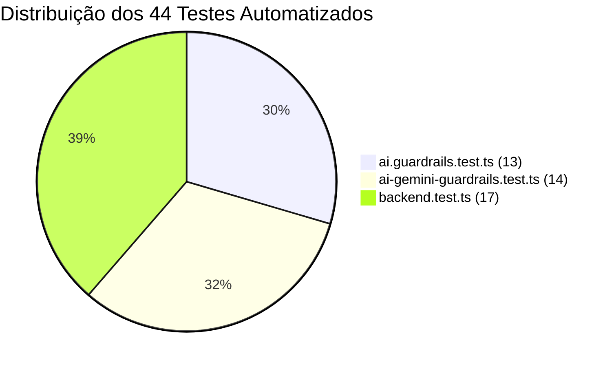

# 🧪 Manual de Desenvolvimento e Testes — DBS Telecom

Este manual fornece as instruções técnicas para desenvolvedores configurarem o ambiente de desenvolvimento, executarem a suíte de **44 testes automatizados**, depurarem a aplicação móvel em múltiplos ambientes e realizarem o build e deploy conteinerizado com **Docker**.

---

## 1. Pré-requisitos do Ambiente

* **Node.js:** Versão 20 LTS recomendada (suporte a Node 18+).
* **Gerenciador de Pacotes:** `npm` v9+ ou superior.
* **Docker & Docker Compose:** Versão 24+ (para execução conteinerizada).
* **Ambiente Mobile (opcional para testes móveis):**
  - **Navegador Web:** Google Chrome, Brave ou Microsoft Edge (para Web Preview instantâneo).
  - **Android Studio:** Com emulador Android configurado (API 33+).
  - **Dispositivo Físico:** Aplicativo **Expo Go** instalado via Google Play Store ou Apple App Store.

---

## 2. Configuração e Execução do Backend BFF

### 2.1 Instalação e Configuração
```bash
cd backend

# 1. Copie o arquivo de variáveis de ambiente
cp .env.example .env

# 2. Instale as dependências
npm install
```

### 2.2 Scripts do `package.json` do Backend

| Comando | Descrição |
| :--- | :--- |
| `npm run dev` | Inicia o servidor HTTP em modo de desenvolvimento com hot-reload automático via `tsx watch`. |
| `npm run build` | Compila o código TypeScript para JavaScript na pasta `dist/`. |
| `npm start` | Inicia o servidor em modo de produção a partir do código compilado (`dist/server.js`). |
| `npm test` | Executa a suíte completa de **44 testes automatizados** com o **Vitest**. |
| `npm run test:watch` | Executa os testes em modo interativo com re-execução automática a cada alteração de arquivo. |

---

## 3. Suíte de Testes Automatizados (Vitest)

O backend possui uma suíte robusta com **44 testes automatizados** distribuídos em 3 arquivos principais:

```bash
cd backend
npm test
```

### 3.1 Detalhamento dos Arquivos de Teste



#### 1. `src/modules/ai/ai.guardrails.test.ts` (13 testes):
* Valida a esteira de defesa de entrada (bloqueio de jailbreak, DAN mode, framing hipotético).
* Valida a detecção e recusa de tentativas de extração de System Prompt.
* Valida a filtragem de assuntos fora de escopo (culinária, política, código).
* Valida a normalização de texto contra homóglifos e caracteres invisíveis.
* Valida a sanitização LGPD e remoção de chaves de API (`AIzaSy...`, `sk-...`).

#### 2. `test/ai-gemini-guardrails.test.ts` (14 testes):
* Valida o classificador de IA com injeção de contexto RAG do IXC.
* Valida a validação estrutural com **Zod Schema** e correção de saídas malformadas.
* Valida as regras anti-alucinação em cenários de adimplência financeira.
* Valida o Fast Router determinístico para intenções comerciais, de suporte e financeiras.

#### 3. `test/backend.test.ts` (17 testes):
* Valida o health check e status dos serviços (`GET /api/health`).
* Valida a autenticação e login de clientes onde a **senha padrão é o CPF** (`POST /api/auth/login`).
* Valida a sincronização de usuários da base do IXC (`POST /api/auth/sync-users`).
* Valida a consulta e formatação de faturas do IXC (`GET /api/financial/invoices/:clientId`).
* Valida o catálogo de planos da DBS Telecom e filtros por tipo (`GET /api/commercial/plans`).
* Valida a máquina de estados do diagnóstico de suporte em 3 etapas (`POST /api/support/diagnostic`).

---

## 4. Configuração e Execução do Aplicativo Mobile

### 4.1 Instalação
```bash
cd mobile

# 1. Copie o arquivo de variáveis de ambiente
cp .env.example .env

# 2. Instale as dependências
npm install
```

### 4.2 Iniciando o Metro Bundler do Expo
```bash
npm start
```

### 4.3 Ambientes de Execução Suportados:

#### 1. Web Preview (Navegador Web — Mais Rápido para Avaliação):
* Pressione a tecla **`w`** no terminal onde o Expo está rodando.
* O navegador abrirá automaticamente em `http://localhost:8081`.

#### 2. Emulador Android (Android Studio):
* Inicie o Emulador no Android Studio.
* Pressione a tecla **`a`** no terminal do Expo.
* > [!NOTE]
  > O arquivo `mobile/src/services/api.ts` detecta automaticamente a plataforma Android e direciona as requisições para `http://10.0.2.2:3000/api` (endereço do host local no emulador Android).

#### 3. Dispositivo Físico com Expo Go:
* Conecte o computador e o smartphone na **mesma rede Wi-Fi**.
* Abra o aplicativo **Expo Go** e escaneie o **QR Code** exibido no terminal.

---

## 5. Execução com Docker & Docker Compose

O projeto está totalmente preparado para execução em containers Docker:

### 5.1 Estrutura do `Dockerfile` (Multi-stage Build)
* **Stage 1 (Build):** Compila o TypeScript em ambiente limpo Node.js 20 Alpine.
* **Stage 2 (Runtime):** Cria uma imagem leve contendo apenas os artefatos compilados e dependências de produção.

### 5.2 Comandos Docker Compose
```bash
# Construir a imagem e subir o backend em segundo plano
docker-compose up -d --build

# Visualizar logs em tempo real
docker-compose logs -f backend

# Parar os containers
docker-compose down
```

---

## 6. Boas Práticas e Padrões de Código

1. **TypeScript Estrito (`strict: true`):** Proibido o uso de `any` não tipado em contratos públicos.
2. **Separação em Camadas:**
   - `services/`: Apenas lógica de negócio e integração com APIs.
   - `routes/`: Validação de requisição HTTP e envio de respostas DTO.
   - `components/`: Componentes visuais desacoplados e reutilizáveis.
3. **Resiliência:** Toda chamada assíncrona externa deve conter `try/catch` com fallback amigável.
